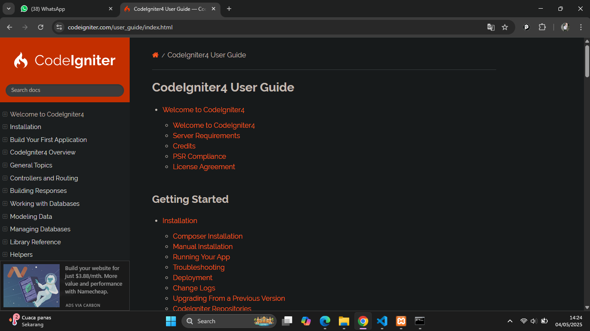
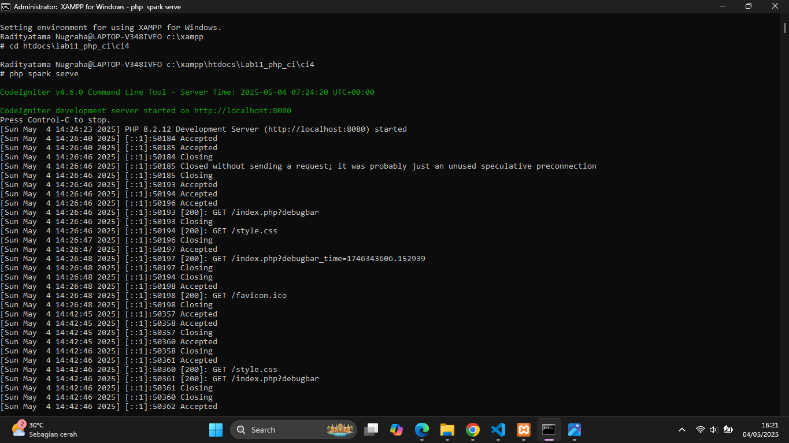
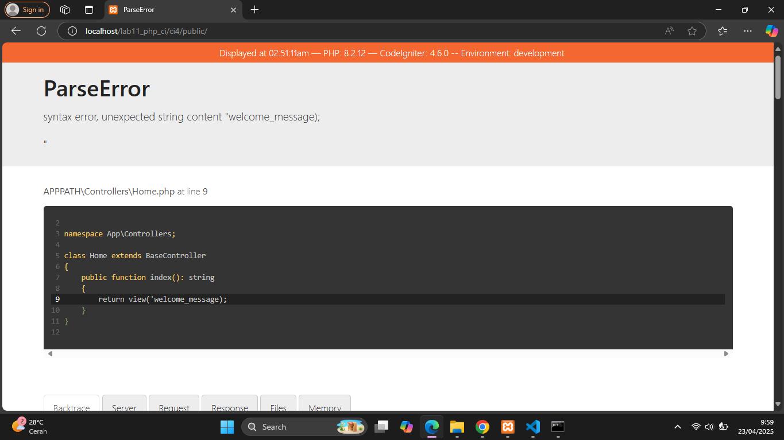
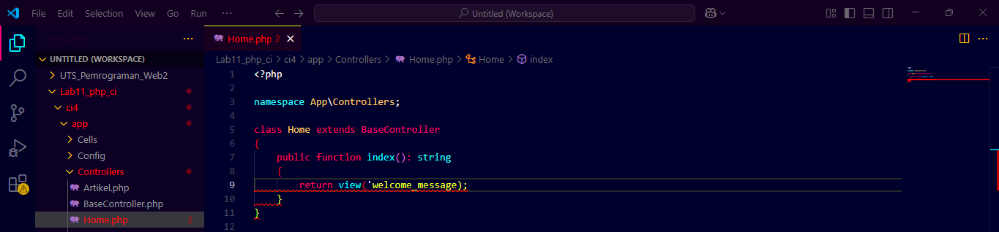
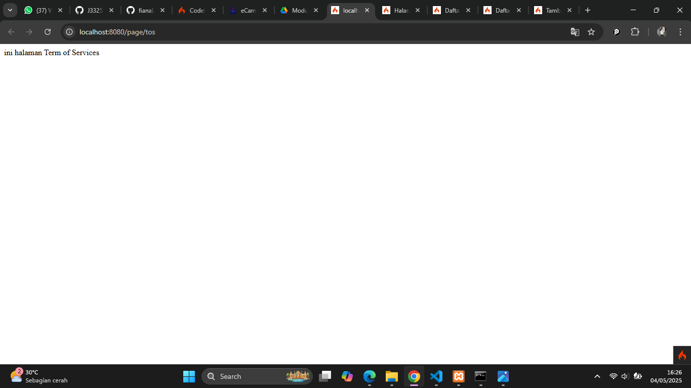
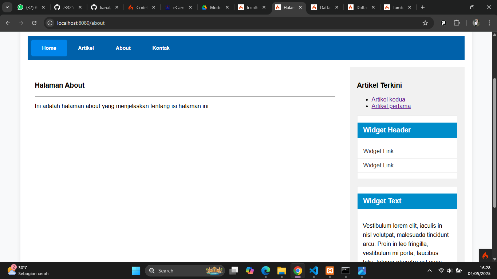

# Tugas Praktikum 1-3

|Nama|NIM|Kelas|Mata Kuliah|
|----|---|-----|------|
|**Radityatama Nugraha**|**312310644**|**TI.23.A6**|**Pemrograman Web 2**|

# Praktikum 1: PHP Framework (Codeigniter)
## Tujuan
1. Mahasiswa mampu memahami konsep dasar Framework.
2. Mahasiswa mampu memahami konsep dasar MVC.
3. Mahasaswa mampu membuat program sederhana menggunakan Framework Codeigniter4.

## Instruksi Praktikum
1. Persiapkan text editor misalnya VSCode.
2. Buat folder baru dengan nama Lab11_php_ci pada docroot webserver (htdocs)

## Instalasi Codeigniter 4
Untuk melakukan instalasi Codeigniter 4 dapat dilakukan dengan dua cara, yaitu cara manual dan menggunakan composer. Pada praktikum ini kita menggunakan cara manual.
1. Unduh Codeigniter dari website https://codeigniter.com/download
2. Extrak file zip Codeigniter ke direktori htdocs/Lab11_php_ci.
3. Ubah nama direktory framework-4.x.xx menjadi ci4.
4. Buka browser dengan alamat http://localhost/Lab11_php_ci/ci4/public/


## Menjalankan CLI (Command Line Interface)
### Codeigniter 4 menyediakan CLI untuk mempermudah proses development. Untuk mengakses CLI buka terminal/command prompt.



### Contoh error yang terjadi. Untuk mencoba error tersebut, ubah kode pada file app/Controller/Home.php hilangkan titik koma pada akhir kode.


## Auto Routing
### Tambahkan method baru pada Controller Page seperti berikut.
```php
public function tos()
{
echo "ini halaman Term of Services";
}
```
### Method ini belum ada pada routing, sehingga cara mengaksesnya dengan menggunakan alamat: http://localhost:8080/page/tos


## Membuat View
### Selanjutnya adalam membuat view untuk tampilan web agar lebih menarik. Buat file baru dengan nama about.php pada direktori view (app/view/about.php) kemudian isi kodenya seperti berikut.
```php
<!DOCTYPE html>
<html lang="en">
<head>
    <meta charset="UTF-8">
    <title><?= $title; ?></title>
</head>
<body>
    <h1><?= $title; ?></h1>
    <hr>
    <p><?= $content; ?></p>
</body>
</html>

```
### Ubah method about pada class Controller Page menjadi seperti berikut:
```php
public function about()
{
    return view('about', [
        'title'   => 'Halaman Abot',
        'content' => 'Ini adalah halaman about yang menjelaskan tentang isi halaman ini.'
    ]);
}
```

## Membuat Layout Web dengan CSS
### Pada dasarnya layout web dengan css dapat diimplamentasikan dengan mudah pada codeigniter. Yang perlu diketahui adalah, pada Codeigniter 4 file yang menyimpan asset css dan javascript terletak pada direktori public.
### Kemudian buat folder template pada direktori view kemudian buat file header.php dan footer.php
#### File app/view/template/header.php
```php
<!DOCTYPE html>
<html lang="en">
<head>
    <meta charset="UTF-8">
    <title><?= $title; ?></title>
    <link rel="stylesheet" href="<?= base_url('/style.css'); ?>">
</head>
<body>
    <div id="container">
    <header>
      <h1>Layout Sederhana</h1>
    </header>
    <nav>
    <a href="<?= base_url('/');?>" class="active">Home</a>
    <a href="<?= base_url('/artikel');?>">Artikel</a>
    <a href="<?= base_url('/about');?>">About</a>
    <a href="<?= base_url('/contact');?>">Kontak</a>
    </nav>
    <section id="wrapper">
      <section id="main">
```
#### File app/view/template/footer.php
```php
</section>

<aside id="sidebar">
    <div class="widget-box">
        <h3 class="title">Widget Header</h3>
        <ul>
            <li><a href="#">Artikel kedua</a></li>
            <li><a href="#">Artikel kesatu</a></li>
        </ul>
    </div>

    <div class="widget-box">
        <h3 class="title">Widget Text</h3>
        <p>Vestibulum lorem elit, iaculis in nisl volutpat, malesuada tincidunt arcu. Proin in leo fringilla, vestibulum mi porta, faucibus felis. Integer pharetra est nunc, nec pretium nunc pretium ac.</p>
    </div>
</aside>

</section>

<footer>
    <p>&copy; 2025 - Universitas Pelita Bangsa</p>
</footer>

</div>
</body>
</html>
```
#### Kemudian ubah file app/view/about.php seperti berikut.
```php
<?= $this->include('template/header'); ?>

<h1><?= $title; ?></h1>
<hr>
<p><?= $content; ?></p>

<?= $this->include('template/footer'); ?>
```
### Selanjutnya refresh tampilan pada alamat http://localhost:8080/about



